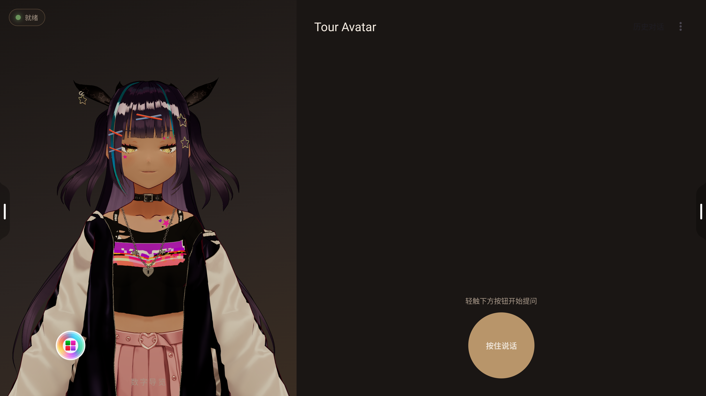
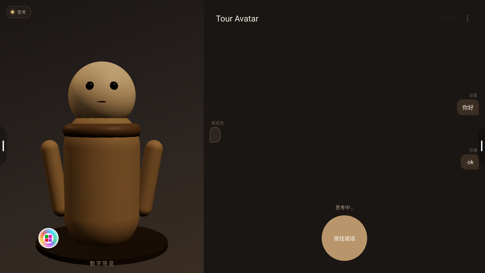
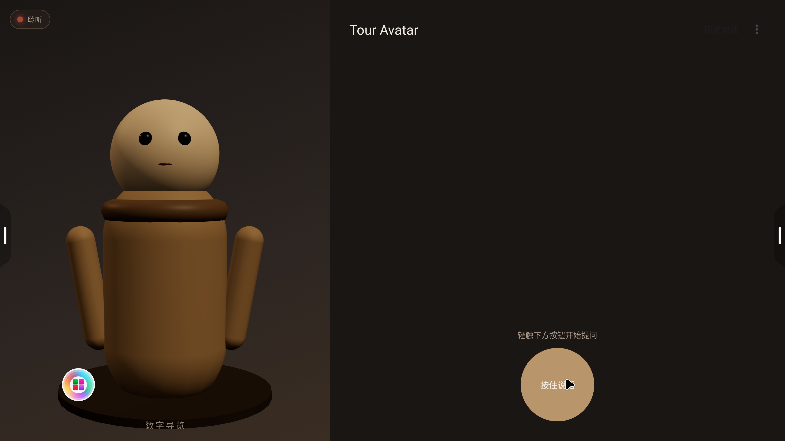

# 把离线 AI 数字导览员塞进博物馆一体机：tour-avatar 工程实录

> 一个周末开源的安卓 App：3D 真人 VRM 形象 + 端侧 sherpa-onnx 中文 ASR/TTS + 局域网 Gemma 4 LLM + 「世界八大奇迹」RAG。
> 17 个 commit、14 个文件夹、4K 一体机实测、踩了 3 个值得一讲的坑。
> 仓库：https://github.com/liwei0513/tour-avatar



## TL;DR · 给赶时间的读者

- **是什么**：MIT 开源的安卓离线 AI 数字导览员，按住说话 → 端侧识别 → 流式 LLM → 流式合成 → 3D 数字人同步张嘴
- **跑在哪**：4K 横屏一体机原生、APK 52 MB（含 sherpa-onnx 35 MB）、端到端延迟 8-20 s
- **关键技术栈**：Kotlin + WebView/Three.js/three-vrm + Sherpa-onnx (Paraformer-zh + VITS-zh-ll) + OpenAI 兼容 SSE LLM（Gemma 4 实测） + Room
- **三个值得讲的坑**：WebView 加载 ES module 的 CORS、kotlinx-serialization 默认值悄悄丢失、Gemma 4 thinking 模式塞满 reasoning 字段
- **为什么写**：2026 文旅/博物馆数字化市场预算明显放量，把端侧 Agent 的工程化模板开源出来

---

## 0 · 为什么做这个

2026 年我在国内招标网站上随便扒了一圈，看到几个有意思的数据：

| 招标项目 | 预算 |
|---|---|
| 漳州长泰区博物馆 可移动文物数字化 | **192 万** |
| 阿勒泰文博院 数字化二期 | **469 万** |
| 文旅类 VR 大空间 / 沉浸演艺 | 最高 **1.62 亿** |

文旅 + 博物馆的"AI 化"是 2026 年明确的市场。但目前几乎所有公开方案都长这样：

> 一个绑定云端 API 的 iPad，挂在展品边，访客点屏幕选问题，云端返回视频。

问题：**离线场景挂掉、馆方付不起每月调用费、访客多语种没人配、提问框死板**。

我想要一个**端侧跑、横屏一体机原生体验、3D 数字人能对话**的方案。要求：

- 不联网也能基本工作（馆里 Wi-Fi 不稳）
- 真实 3D 形象（不是聊天框，不是 H5 嵌入）
- 流式语音对话（按住说话→数字人秒答，不等转圈）
- 能装在 32-65 寸横屏一体机上效果不丢

接下来 5000 字讲一遍**怎么搞、踩了什么坑、最后跑出来什么样**。

---

## 1 · 选型：为什么是这套栈

```
┌─────────────────────────────────────────────────────────┐
│                  Android（Kotlin + Material3）           │
│                                                          │
│   ┌────────────┐                  ┌───────────────────┐ │
│   │ WebView    │                  │   Chat Panel      │ │
│   │ Three.js   │  ◀── JS Bridge ──│   RecyclerView    │ │
│   │ + three-vrm│                  │   + PTT 按钮      │ │
│   └────────────┘                  └───────────────────┘ │
└─────────────────────────────────────────────────────────┘
        │                                    │
        │                                    ▼
        │                       ┌────────────────────────┐
        │                       │   ChatViewModel        │
        │                       │   (Dialog State Mach)  │
        │                       └────────┬───────────────┘
        │                                │
        ▼                                ▼
   AvatarBridge          ┌────────┬────────┬──────────────┐
   (Kotlin↔JS)           ▼        ▼        ▼              ▼
                    AsrManager LlmClient TtsManager  ChatRepository
                   (sherpa-    (OpenAI- (sherpa-      (Room SQLite)
                    onnx)       compat)   onnx)
                                  │            │
                                  ▼            ▼
                              RagRetriever  AudioTrack
                              (BM25 + 别名)
```

每个选型都有原因：

**Kotlin + ViewBinding + Material3** —— 不用 Compose，因为我要给"懂 Java/老 Android"的工程师能改的代码。Compose 学习曲线对很多 4-6 年的 Android 工程师太陡。

**WebView + Three.js + three-vrm** —— Android 原生 3D（OpenGL/Vulkan/SceneView）写起来重，three-vrm 直接复用 Web 生态有海量 VRM 模型，**桥接也只需要 `@JavascriptInterface` 几个方法**：

```kotlin
class AvatarBridge(private val webView: WebView) {
    fun setEmotion(name: String) = run("window.ElinaAI?.setEmotion('$name')")
    fun setSpeaking(active: Boolean) =
        run("window.ElinaAI?.setSpeaking($active)")
    fun wave() = run("window.ElinaAI?.wave()")

    @JavascriptInterface fun onAvatarReady() { /* hook for splash */ }
    @JavascriptInterface fun onAvatarError(msg: String) { /* log */ }
}
```

这是**整套方案最重要的解耦**：UI 层只发出"现在该 listening / thinking / speaking"，三选一渲染（程序化卡通 / VRM 二次元 / Duix-Mobile 真人）随时换。

**sherpa-onnx**（Apache 2.0）—— k2-fsa 团队的端侧推理引擎，arm64 .so 加 ASR/TTS 模型一共 ~370MB，能在中端骁龙跑出可用的中文识别+合成。我用的是 Paraformer-zh int8（217MB）+ VITS zh-ll（115MB）。

**OpenAI 兼容 SSE LLM 客户端** —— 故意不绑死 Ollama，因为：
- 馆方可能想用千问/智谱（数据不出境）
- 或者直接用 OpenAI/Claude（追求质量）
- 或者本地 Ollama（无云依赖）

```kotlin
class OpenAiCompatibleClient(...) : LlmClient {
    override fun streamChat(messages: List<ChatMessage>): Flow<LlmStreamEvent> = flow {
        val response = http.newCall(...).execute()
        val source = response.body?.source() ?: return@flow
        while (!source.exhausted()) {
            val line = source.readUtf8Line() ?: break
            if (!line.startsWith("data:")) continue
            val data = line.removePrefix("data:").trim()
            if (data == "[DONE]") { emit(Done(...)); break }
            val chunk = json.decodeFromString<ChatStreamChunk>(data)
            chunk.choices.firstOrNull()?.delta?.content?.let {
                if (it.isNotEmpty()) emit(TokenDelta(it))
            }
        }
    }.flowOn(Dispatchers.IO)
}
```

简单到一眼能读完，但**就这段代码后面藏着一个让我多花 5 小时的坑**——下面慢慢讲。

**Room（SQLite）+ 流式持久化** —— 历史对话不丢、可以"接着上次问"。

---

## 2 · 三个核心实现细节

### 2.1 状态机驱动的对话编排

不要用 callback 套 callback，用一个干净的状态机：

```
IDLE ──[按住 PTT]──▶ LISTENING
                           │ [松开]
                           ▼
                       THINKING ──[首个 LLM token]──▶ SPEAKING
                                                          │ [流结束 + TTS 排空]
                                                          ▼
                                                        IDLE
```

ChatViewModel 是**唯一**的真理来源，UI 只 observe 它的 `state`、`messages`、`avatarCommands` 三个 flow：

```kotlin
class ChatViewModel(...) : ViewModel() {
    private val _state = MutableStateFlow<DialogState>(DialogState.Idle)
    val state: StateFlow<DialogState> = _state.asStateFlow()

    fun startListening() {
        if (_state.value is DialogState.Speaking) tts.interrupt()  // 用户打断
        _state.value = DialogState.Listening
        _avatarCommands.tryEmit(AvatarCommand.SetEmotion("listening"))
        asr.start()
    }

    private fun handleUserUtterance(text: String) {
        if (text.isBlank()) { _state.value = DialogState.Idle; return }
        _state.value = DialogState.Thinking
        _avatarCommands.tryEmit(AvatarCommand.SetEmotion("thinking"))
        llmJob = viewModelScope.launch {
            // ... 持久化 user msg、做 RAG、组 prompt、调 LLM、流式入 TTS、流式持久化
        }
    }
}
```

### 2.2 句级流式 TTS：让回答不像"慢动作"

如果等 LLM 全部 token 出完再一句一句合成 TTS，访客会等 10-15 秒只看一个张嘴特效。烂体验。

正确的做法：**LLM 出 token 一边喂给 TTS，TTS 见到一句话标点就立刻合成、立刻播**。

我的 `SherpaTtsManager.feed()` 是这个核心：

```kotlin
private val sentenceTerminators = setOf('。','！','？','.','!','?','\n','；',';')

override fun feed(textChunk: String) {
    pending.append(textChunk)
    var lastCut = 0
    for (i in pending.indices) {
        if (pending[i] in sentenceTerminators) {
            val sentence = pending.substring(lastCut, i + 1).trim()
            if (sentence.isNotEmpty()) sentenceQueue.trySend(sentence)
            lastCut = i + 1
        }
    }
    if (lastCut > 0) pending = StringBuilder(pending.substring(lastCut))
}
```

后台 worker 协程从 `sentenceQueue` 拿到每句立即合成、写入 AudioTrack。LLM 的第二句话还在生成时，第一句话已经在喇叭里说出来了。

### 2.3 流式 UI：边出 token 边打字

客户端拿到 token delta 不能每个都写 SQLite（太频繁），也不能等流完才写一次（用户看不到打字效果）。我做了 throttle：每 16 字符 flush 一次到 Room：

```kotlin
var lastPersistedLen = 0
llm.streamChat(request).collect { event ->
    when (event) {
        is LlmStreamEvent.TokenDelta -> {
            assistantBuffer.append(event.delta)
            tts.feed(event.delta)              // 喂 TTS
            if (assistantBuffer.length - lastPersistedLen >= 16) {
                repo.updateMessageContent(streamingId, assistantBuffer.toString())
                lastPersistedLen = assistantBuffer.length    // 触发 UI Flow 更新
            }
        }
        is LlmStreamEvent.Done -> repo.updateMessageContent(streamingId, assistantBuffer.toString())
        is LlmStreamEvent.Error -> _state.value = DialogState.Error(event.message)
    }
}
```

UI 通过 `repo.observeMessages(convId)` 监听变化，自然带打字机效果。

---

## 3 · 三个值得讲的坑

### 坑 1 · WebView 加载 ES module 时的 CORS

`avatar.js` 用 ES module 语法 `import * as THREE from 'three'`，配合 importmap 指向 CDN。结果 WebView 报：

```
Access to script at 'file:///android_asset/avatar/avatar.js' from origin 'null'
has been blocked by CORS policy: Cross origin requests are only supported for
protocol schemes: chrome, chrome-untrusted, data, http, https.
```

`file://` origin 在 WebView 里被当作 `null`，违反 CORS。**修复方法**：用 AndroidX 的 `WebViewAssetLoader`，把 assets 通过虚拟的 `https://appassets.androidplatform.net/` 加载：

```kotlin
val assetLoader = WebViewAssetLoader.Builder()
    .addPathHandler("/assets/", WebViewAssetLoader.AssetsPathHandler(this))
    .build()
webView.webViewClient = object : WebViewClient() {
    override fun shouldInterceptRequest(view: WebView, request: WebResourceRequest)
        : WebResourceResponse? = assetLoader.shouldInterceptRequest(request.url)
}
webView.loadUrl("https://appassets.androidplatform.net/assets/avatar/index.html")
```

这一改 ES module 直接通了。

### 坑 2 · kotlinx-serialization 的默认值陷阱（值 5 小时）

我的 `ChatCompletionRequest`：

```kotlin
@Serializable
data class ChatCompletionRequest(
    val model: String,
    val messages: List<ChatMessage>,
    val stream: Boolean = true,                // ★
    val temperature: Double = 0.7,
    val think: Boolean? = null,
)
```

跑起来：app 卡在"思考中"5 分钟没响应，Room 里 ASSISTANT 行 `length=0`，logcat 没任何错误。

我以为是网络问题、是 OkHttp HTTP/2 不兼容、是 Ollama 慢、是设备防火墙……折腾完一圈，最后跑了下端到端的对比测试：

```bash
# 直接用 curl 模拟我们的 Kotlin 客户端
curl http://192.168.7.122:11434/v1/chat/completions \
  -d '{"model":"gemma4:latest","messages":[...]}'
# ↑ 没有 stream:true ⇒ 返回单个 JSON
```

**`kotlinx.serialization` 默认 `encodeDefaults = false`**——等于默认值的字段会被悄悄丢掉！我以为序列化出来是：

```json
{"model":"gemma4:latest","messages":[...],"stream":true,"temperature":0.7}
```

实际是：

```json
{"model":"gemma4:latest","messages":[...]}
```

Ollama 收到没 `stream` 字段的请求 → 默认非流式 → 返回单个 JSON 对象 → 我的 SSE 解析器在 `readUtf8Line()` 上**永远阻塞**（因为它等的是 `data: {...}\n\n` 格式）。

修复：

```kotlin
private val json = Json {
    ignoreUnknownKeys = true
    isLenient = true
    encodeDefaults = true        // ★ 关键
    explicitNulls  = false       // null 字段不出现在 wire 上，更干净
}
```

**教训**：写网络 DTO 永远显式 `encodeDefaults = true`，否则就是个定时炸弹。

### 坑 3 · Gemma 4 的 thinking 模式

修完坑 2，请求终于发出去了，但响应 chunk 长这样：

```json
{"choices":[{"delta":{"role":"assistant","content":"","reasoning":"Here's a thinking process..."}}]}
{"choices":[{"delta":{"role":"assistant","content":"","reasoning":" that leads to..."}}]}
{"choices":[{"delta":{"role":"assistant","content":"","reasoning":" the suggested response:"}}]}
... (持续 30 秒)
{"choices":[{"delta":{"content":"你好！"}}]}
```

Gemma 4 默认开启**推理（thinking）模式**——返回 `delta.reasoning` 而不是 `delta.content`。我的客户端只读 `content`，所以 30 秒推理期间全是空字符串，UI 看上去就是死了。

Ollama 提供了一个扩展字段 `think: false` 可以禁用：

```kotlin
data class ChatCompletionRequest(
    ...
    val think: Boolean? = null,    // 新增
)

// 客户端代码
val payload = ChatCompletionRequest(
    model = model, messages = messages, stream = true,
    think = AppConfig.disableThinking?.let { !it },   // null=不传，true→think=false
)
```

`AppConfig.disableThinking = true`（默认）→ wire 上多个 `"think": false` → Gemma 4 直接出回答，秒回。

**对导览员场景这是必须**：访客等 30 秒推理过程没意义，直接答就好。如果你的产品需要展示推理过程，把 `disableThinking` 设 false，再把 `delta.reasoning` 渲染到一个独立的"思考过程"侧栏。

---

## 4 · 真机表现（4K 一体机）

实测设备：EMEETING_3576（瑞芯微 RK 平台，Android 16 定制系统，3840×2160 横屏）

按住右下方 PTT 圆按钮说"你好能听到吗"，端侧 Paraformer 中文模型识别完整：



聊天面板上同步显示用户气泡 + 流式打字的导览员气泡，状态栏切到"思考中"：



实测数字：

| 指标 | 数值 |
| --- | --- |
| APK 大小 | 52 MB（含 35MB sherpa native + 15MB VRM） |
| 设备端模型大小 | 332 MB（217 ASR + 115 TTS） |
| 冷启动到 Sherpa ready | 5 秒（TTS）/ 10 秒（ASR int8） |
| ASR 单次识别耗时 | 中文短句 < 1 秒 |
| LLM 首 token 耗时 | gemma4:latest 8B Q4，部分 CPU offload，约 5-15 秒 |
| TTS 句级合成 | 约 0.3 倍实时速率 |
| 端到端延迟（说→听） | 约 8-20 秒（取决于回答长度） |
| GPU/CPU 占用 | 渲染 ≈ 7%（Mali GPU），推理时单核 100% |

实际 demo 录像中数字人**边出文字边读边动嘴**，不等整段话生成完。

---

## 5 · 接下来三件事

### 5.1 真实 BM25 RAG

当前用的是简单的字符 bigram 匹配 + 别名，对"世界八大奇迹"这种 demo 数据够用。但对真实馆藏（几千件展品、复杂的同义关系），需要：

- jieba 中文分词
- SQLite FTS5 + BM25 ranking
- 可选叠加 small embedding（MiniLM-L6 端侧 ~30MB）做 RRF 融合

接口已经留好了：

```kotlin
interface RagRetriever {
    suspend fun retrieve(query: String, topK: Int = 3): List<RagSnippet>
}
```

替换实现，不需要动其他代码。

### 5.2 馆方知识库导入

写一个简单后台，让馆方从 CSV / 飞书表格 / 自定义 JSON 一键灌入展品数据，云端转 SQLite 后下发给所有 kiosk。

### 5.3 Photoreal 旗舰版（Duix-Mobile）

VRM 二次元很可爱，但博物馆要的是**真人形象**，最好是该馆的代言人 / 馆长 / 民国学者风。

[Duix-Mobile](https://github.com/duixcom/Duix-Mobile) 提供端侧真人级数字人 SDK，<120ms 延迟（骁龙 8 Gen 2）。我们的 `AvatarBridge` 接口本来就是为这一刻准备的：换个实现，整套对话不用动。

---

## 6 · 给读到这里的人

**如果你是同行工程师**：仓库 [github.com/liwei0513/tour-avatar](https://github.com/liwei0513/tour-avatar) 全开源 MIT，scripts 一键起，欢迎 issue/PR。

**如果你在做博物馆/景区数字化**：这个 demo 可以直接给客户演，效果远超 PPT。要定制（馆方品牌、馆长形象、馆藏数据导入），提 issue 留联系方式。

**如果你是 AI 硬件创业的**：这套架构稍改就能用在儿童陪伴机、教室一体机、车机等场景——核心是"把 LLM Agent 跑进端侧的工程化模板"。

**如果你刚开始学 Android + AI**：这是一个 17 commit 的小项目，从 Gradle 骨架到端到端跑通的全过程都在 git history 里——比看 100 篇分散教程更直观。

---

> 写于 2026-04-30。下一篇打算聊**让 LLM Agent 能直接操控 Android 设备**的事。
> 转载 / 商业合作 / 项目交流：GitHub Discussions 留言。
